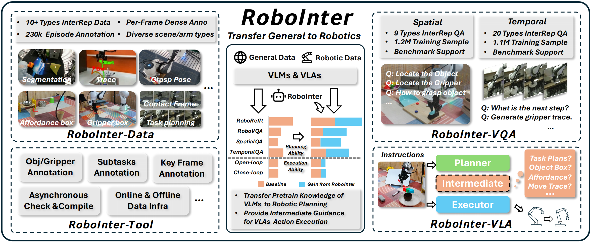

<div align="center">

# RoboInter: A Holistic Intermediate Representation Suite Towards Robotic Manipulation

</div>

<div align="center">

Hao Li\*, Ziqin Wang\*

*University of Science and Technology of China, Beihang University, Shanghai AI Laboratory*


</div>

<div align="center">
    <a href=''></a> &nbsp;
    <a href='https://lihaohn.github.io/RoboInter.github.io/'></a> &nbsp;
    <a href="https://huggingface.co/spaces/wz7in/robointer-demo">
    
    </a>
    <br>
    <a href='https://huggingface.co/datasets/InternRobotics/RoboInter-Data'></a> &nbsp; 
    <a href='https://huggingface.co/datasets/InternRobotics/RoboInter-VQA'></a> &nbsp;
    <a href='https://huggingface.co/InternRobotics/RoboInter-VLM'></a> &nbsp;
</div>

---

## Introduction


**RoboInter Manipulation Suite** addresses this gap with a unified resource of **data**, **benchmarks**, and **models** of intermediate representations for manipulation. It comprises:

- **RoboInter-Tool** -- A lightweight GUI enabling semi-automatic annotation of diverse intermediate representations with human-in-the-loop verification.
- **RoboInter-Data** -- A large-scale dataset with **230k+ episodes** across **571 diverse scenes** and **6 robot arm types**, providing dense per-frame annotations over **10+ categories** of intermediate representations.
- **RoboInter-VQA** -- **9 spatial** and **20 temporal** embodied VQA categories to systematically benchmark and enhance the embodied reasoning capabilities of VLMs, comprising **~2.3M** QA samples in total.
- **RoboInter-VLM** -- VLM-based Planners (Qwen2.5-VL & LLaVA-OneVision) fine-tuned on RoboInter-VQA, achieving strong embodied reasoning and grounding capabilities for generating intermediate representations as high-level plans.
- **RoboInter-VLA** -- An integrated *plan-then-execute* framework supporting modular and end-to-end VLA variants that bridge high-level planning with low-level execution via intermediate supervision.

---
<p align="center">
    
</p>


## 🌟🌟 Highlights

- **Largest intermediate representation dataset for manipulation**: 230k+ episodes with dense per-frame annotations, substantially exceeding prior work (LLARVA, ECoT, ShareRobot) in both scale and diversity.
- **10+ types of dense annotations**: Subtasks, primitive skills, segmentation, object/gripper bounding boxes, placement proposals, affordance boxes, grasp poses, motion traces, contact points, and more -- all temporally aligned with actions.
- **Comprehensive VQA benchmark**: 2.3M samples spanning spatial and temporal dimensions, covering both understanding and generation tasks.
- **Plan-then-execute VLA framework**: Supports three paradigms -- Implicitly-Conditioned E2E (IC-E2E), Explicitly-Conditioned E2E (EC-E2E), and Modular Planner-to-Executor -- with Flexible Chain-of-Thought (F-CoT) bridging planning and execution.
- **Significant performance gains**: RoboInter-VLMs achieve up to **76.8%** improvement on RoboRefIt and **42.8%** on RoboVQA over prior embodied VLMs at 7B scale.

---

## News

- `2026/02` RoboInter paper, data, and code are released.
- `2026/01` RoboInter was accepted to ICLR 2026.

---

## Table of Contents

- [Introduction](#introduction)
- [Highlights](#highlights)
- [Repository Structure](#repository-structure)
- [Getting Started](#getting-started)
- [RoboInter-Data](#robointer-data)
- [RoboInter-VQA & VLM](#robointer-vqa--vlm)
- [RoboInter-VLA](#robointer-vla)
- [RoboInter-Tool](#robointer-tool)
- [Demo & Visualization](#demo--visualization)
- [Further Applications](#further-applications)
- [TODO](#todo)
- [Citation](#citation)
- [License](#license)
- [Acknowledgements](#acknowledgements)

---

## Repository Structure

```
RoboInter/
├── RoboInterData/          # Data conversion, LMDB tools, and PyTorch dataloader
├── RoboInterData-Demo/     # Gradio-based annotation visualization app
├── RoboInterVLM/           # VLM training (Qwen2.5-VL & LLaVA-OneVision based)
├── RoboInterVLA/           # Plan-then-execute VLA framework
├── RoboInterTools/         # Semi-automatic annotation toolkit with SAM2
├── asset/                  # Paper, figures, and resources
├── LICENSE
└── README.md
```

---

## Getting Started

### 1. Clone the Repository

```bash
git clone https://github.com/InternRobotics/RoboInter.git
cd RoboInter
```

### 2. Choose Your Component

| If you want to... | Go to |
|---|---|
| Load & train on RoboInter-Data | [`RoboInterData/`](RoboInterData/) |
| Visualize annotations interactively | [`RoboInterData-Demo/`](RoboInterData-Demo/) |
| Train / evaluate RoboInter-VLMs | [`RoboInterVLM/`](RoboInterVLM/) |
| Train / deploy RoboInter-VLA | [`RoboInterVLA/`](RoboInterVLA/) |
| Annotate your own data | [`RoboInterTools/`](RoboInterTools/) |

Each subdirectory contains its own `README.md` with detailed installation and usage instructions.

---

## RoboInter-Data

**230k+ episodes | 571 scenes | 6 robot arms | 10+ annotation types | Dense per-frame alignment**

<details>
<summary><b>Intermediate Representation Types</b></summary>

| Annotation | Format | Description |
|---|---|---|
| Time Clip | `[[start, end], ...]` | Temporal action segment boundaries |
| Language Instruction | string | Natural language task instruction |
| Subtask | string | Current subtask description |
| Primitive Skill | string | Skill label (pick, place, push, twist, ...) |
| Segmentation | mask | SAM2-based object segmentation & tracking |
| Object Box | `[[x1,y1],[x2,y2]]` | Target object bounding box |
| Placement Proposal | `[[x1,y1],[x2,y2]]` | Target placement location |
| Trace | `[[x,y], ...]` | Future 10-frame gripper trajectory |
| Gripper Box | `[[x1,y1],[x2,y2]]` | End-effector bounding box |
| Contact Frame | int | Frame index of robot-object contact |
| State Affordance | `[x,y,z,rx,ry,rz]` | 6D EE pose at contact |
| Affordance Box | `[[x1,y1],[x2,y2]]` | Gripper box at contact frame |
| Contact Points | `[x,y]` | Contact point pixel coordinates |

</details>

### Download

The dataset is available on HuggingFace:

```bash
# Install huggingface_hub if needed
pip install huggingface_hub

# Download via CLI
huggingface-cli download InternRobotics/RoboInter-Data --repo-type dataset --local-dir ./RoboInter-Data
```

### DataLoader

We provide a portable PyTorch dataloader in [`RoboInterData/lerobot_dataloader/`](RoboInterData/lerobot_dataloader/) with support for action chunking, quality-based filtering, and frame range filtering:

```python
from lerobot_dataloader import create_dataloader, QAnnotationFilter

dataloader = create_dataloader(
    "/path/to/lerobot_dataset",
    batch_size=32,
    action_horizon=16,
    q_filters=[QAnnotationFilter("Q_annotation.trace", ["Primary"])],
)

for batch in dataloader:
    images = batch["observation.images.primary"]  # (B, H, W, 3)
    actions = batch["action"]                     # (B, 16, 7)
    trace = batch["annotation.trace"]             # Parsed annotations
    break
```

See [`RoboInterData/README.md`](RoboInterData/README.md) for format conversion tools, LMDB utilities, and more.

---

## RoboInter-VQA & VLM

**9 spatial + 20 temporal VQA categories | ~2.3M training samples | Benchmark support**

RoboInter-VQA converts dense annotations into diverse visual question answering tasks organized along two axes -- **intermediate representation type** (spatial vs. temporal) and **target capability** (understanding vs. generation):

- **Spatial Understanding**: Object grounding selection, grasp pose selection, scene-instruction matching, contact judgment
- **Spatial Generation**: Object box prediction, grasp pose prediction, placement proposal, contact points, gripper box
- **Temporal Understanding**: Movement direction, trace-description matching, subtask/skill discrimination, success judgment
- **Temporal Generation**: Trace generation, multi-step planning, next-step prediction

We provide two VLM training frameworks in [`RoboInterVLM/`](RoboInterVLM/):

| Model | Base | Scale | Highlights |
|---|---|---|---|
| RoboInter-Qwen | Qwen2.5-VL | 3B / 7B | MoE architecture, strong grounding |
| RoboInter-LLaVA | LLaVA-OneVision | 7B | Multi-image temporal reasoning |

---

## RoboInter-VLA

RoboInter-VLA follows a ***plan-then-execute*** paradigm with a VLM-based **Planner** and a DiT-based **Executor**, supporting three variants:

| Variant | Type | Description |
|---|---|---|
| **RoboInter-IC-E2E** | End-to-End | Implicitly conditioned -- uses pretrained Planner as a stronger vision-language backbone |
| **RoboInter-EC-E2E** | End-to-End | Explicitly conditioned -- jointly optimizes intermediate reasoning and action generation |
| **RoboInter-Modular** | Non-E2E | Decoupled Planner and Executor with Flexible Chain-of-Thought (F-CoT) |

Intermediate representations are bridged via **F-CoT**, a flexible chain-of-thought that combines subtasks, skills, object boxes, affordance boxes, motion traces, etc., in textual or visual form.

See [`RoboInterVLA/README.md`](RoboInterVLA/README.md) for training and deployment instructions.

---

## RoboInter-Tool

A lightweight client-server annotation toolkit powered by SAM2 for semi-automatic per-frame annotation of manipulation videos. Features include:

- Multi-user parallel annotation with iterative quality checking
- Automatic SAM2 segmentation & tracking with human-in-the-loop review
- ChatGPT-assisted preliminary language annotation references
- Support for all 10+ intermediate representation types

See [`RoboInterTools/README.md`](RoboInterTools/README.md) for setup and usage.

---

## Demo & Visualization

We provide a Gradio-based web application for interactive visualization of annotations:

```bash
cd RoboInterData-Demo
pip install -r requirements.txt
python app.py
```

See [`RoboInterData-Demo/README.md`](RoboInterData-Demo/README.md) for details.

---

## 🔥🔥 Further Applications

Beyond training VLMs and VLAs, RoboInter-Data opens the door to broader research directions:

**Expert Generative Models for Individual Intermediate Representations.** RoboInter-Data spans diverse embodied scenes while providing large-scale, high-quality annotations for each intermediate representation, enabling the pre-training of specialized generative models tailored to specific representations (e.g., a dedicated trace predictor, a grasp pose generator, or a subtask planner).

**Human-Robot Interaction.** Intermediate representations such as traces, bounding boxes, and subtask sequences naturally bridge high-level instructions and low-level control. RoboInter-Data supports the development of intuitive and precise shared-autonomy systems grounded in these representations.

**Embodied World Model Learning.** All annotations are temporally aligned with 640x360 raw manipulation videos. These intermediate representations can serve as structured control signals for controllable video generation, while the aligned information about the robot, objects, and environment provides strong supervision for learning structured embodied world models.

**Video Action Model Learning.** The combination of action annotations, videos, and diverse intermediate representations makes RoboInter-Data well suited for training video action models with rich, multi-level supervision.


---

## TODO

- [x] Release RoboInter-Data on HuggingFace
- [x] Release RoboInterData (conversion tools & dataloader)
- [x] Release RoboInterTools (annotation toolkit)
- [x] Release RoboInterData-Demo (visualization)
- [x] Release RoboInterVLM (VLM training)
- [x] Release RoboInter-VQA benchmark evaluation toolkit
- [ ] Release RoboInterVLA model
- [ ] RoboInter-Data support lerobot v3.0, and release the data
- [ ] Release more pre-trained model checkpoints

---

## Citation

If you find RoboInter useful in your research, please consider citing:

```bibtex
@article{li2025robointer,
  title={RoboInter: A Holistic Intermediate Representation Suite Towards Robotic Manipulation},
  author={Li, Hao and Wang, Ziqin and Ding, Zi-han and Yang, Shuai and Chen, Yilun and Tian, Yang and Hu, Xiaolin and Wang, Tai and Lin, Dahua and Zhao, Feng and Liu, Si and Pang, Jiangmiao},
  journal={arXiv preprint arXiv:2507.16834},
  year={2025}
}
```

---

## License

This project is released under the [MIT License](LICENSE).

---

## Acknowledgements

- [DROID](https://droid-dataset.github.io/) and [RH20T](https://rh20t.github.io/) for providing the foundational manipulation datasets.
- [SAM2](https://github.com/facebookresearch/sam2) for powering the segmentation and tracking in RoboInter-Tool.
- [Qwen2.5-VL](https://github.com/QwenLM/Qwen2.5-VL) and [LLaVA-OneVision](https://github.com/LLaVA-VL/LLaVA-NeXT) for the VLM backbones.
- [CogACT](https://github.com/microsoft/CogACT) and [InternVLA-M1](https://github.com/InternRobotics/InternVLA-M1) for the VLA codebase.
- [LeRobot](https://github.com/huggingface/lerobot) and [lmdb](https://github.com/LMDB/lmdb) for the dataset format standard.
