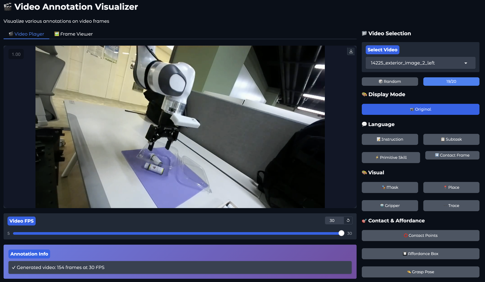

[English](README.md) | [中文](README_zh.md)

# RoboInter Demo Visualizer

A Gradio-based visualization tool for robot interaction annotations, supporting language instructions, visual annotations, grasp poses, and more.

## Online Demo

We provide an online demo hosted on HuggingFace Spaces. Due to storage limitations, only **20 sampled videos** are available online.

> **[Try the Online Demo](https://huggingface.co/spaces/wz7in/robointer-demo)**

For the full dataset (120 videos), please run locally as described below.

## Visualization



## Local Setup

### 1. Clone the repository

```bash
git clone https://github.com/InternRobotics/RoboInter
cd RoboInter/RoboInterData-Demo
```

### 2. Download data

Download the full annotation data and videos from our HuggingFace dataset:

```bash
# Install huggingface_hub if needed
pip install huggingface_hub

# Download dataset
python -c "
from huggingface_hub import snapshot_download
snapshot_download(repo_id='wz7in/robointer-demo-data', repo_type='dataset', local_dir='.')
"
# or
from huggingface_hub import snapshot_download
snapshot_download(
    repo_id="InternRobotics/RoboInter-Data",
    repo_type="dataset",
    local_dir="/your/local/path/Annotation_demo_app",
    allow_patterns="Annotation_demo_app/*"
)
```

This will download:
- `demo_data/` — LMDB database containing all annotations
- `videos/` — video files (`.mp4`)

### 3. Install dependencies

```bash
pip install -r requirements.txt
```

### 4. Run

```bash
python app.py
```

Then open http://localhost:7860 in your browser.

## Annotation Types

### Language Annotations
| Type | Description |
|------|-------------|
| **Instruction** | Task instruction for each frame |
| **Subtask** | Subtask description |
| **Primitive Skill** | Low-level skill label |

### Visual Annotations
| Type | Color | Description |
|------|-------|-------------|
| **Object Mask** | Cyan | Segmentation mask with contour edges |
| **Placement Proposal** | Green | Target placement bounding box |
| **Gripper Box** | Yellow | Gripper bounding box |
| **Trace** | Purple | Motion trajectory with gradient |

### Contact & Affordance
| Type | Color | Description |
|------|-------|-------------|
| **Contact Points** | Orange | Contact keypoints on objects |
| **Affordance Box** | Red | Affordance region bounding box |
| **Grasp Pose** | Green | 6-keypoint gripper grasp pose |

## Data Format

Annotations are stored in an LMDB database. Each video maps to a dict of per-frame annotations:

```python
{
    "video_name": {
        frame_idx: {
            "instruction_add": str,
            "substask": str,
            "primitive_skill": str,
            "segmentation": np.ndarray (H, W),   # binary mask
            "object_box": [[x1, y1], [x2, y2]],
            "placement_proposal": [[x1, y1], [x2, y2]],
            "trace": [[x, y], ...],
            "gripper_box": [[x1, y1], [x2, y2]],
            "contact_frame": int,
            "affordance_box": [[x1, y1], [x2, y2]],
            "contact_points": [[x, y], ...],
            "grasp_pose": [[x, y], ...],          # 6 keypoints
        },
    },
}
```

## Project Structure

```
RoboInterData-Demo/
├── app.py              # Main Gradio application
├── config.py           # Configuration & data loading
├── README.md           # English documentation
├── README_zh.md        # Chinese documentation
├── demo_data/          # LMDB annotation database
│   ├── data.mdb
│   └── lock.mdb
└── videos/             # Video files
    └── *.mp4
```

## License

This project is released for research and demonstration purposes.
