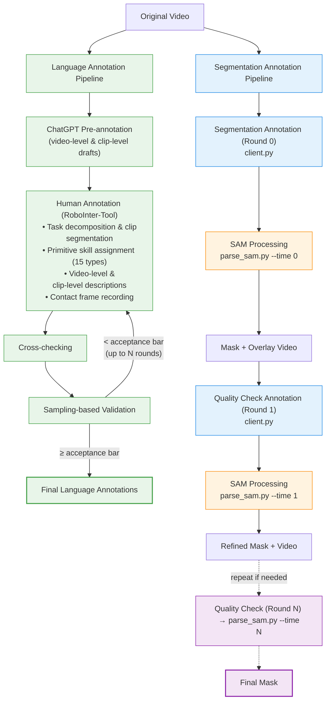

[中文版](README_zh.md)

# RoboInter-Tools

This is the official implementation of the annotation toolkit **RoboInter-Tools** from the paper:

> **RoboInter: A Holistic Intermediate Representation Suite Towards Robotic Manipulation**

RoboInter-Tools provides a complete pipeline for video segmentation and language annotation using SAM2 (Segment Anything Model 2). It includes a multi-user annotation server, a Qt-based annotation client, and a batch SAM mask generation pipeline.

The overall workflow consists of two stages: **Annotation** and **SAM Mask Generation**. Segmentation annotation and SAM processing alternate in a multi-round loop for iterative quality checking, until samples are marked as hard or finished:



### Language Annotation Mode

<p align="center">
  
</p>

### Segmentation Annotation Mode (SAM)

<p align="center">
  
</p>

## Project Structure

```
tracker_tools_release/
├── client/
│   ├── client.py                  # Qt annotation GUI
│   └── utils.py                   # Server communication utilities
├── server/
│   └── server.py                  # Flask annotation server
├── tools/
│   ├── parse_sam.py               # SAM batch processing CLI
│   ├── sam_tools.py               # Core SAM functions
│   └── generate_annotation_pool.py
├── config/
│   └── config.yaml                # Configuration file
├── segment-anything-2/            # SAM2 model
├── requirements.txt
└── README.md
```

## Installation

```bash
git clone <repository-url>
cd RoboInterTool
pip install -r requirements.txt
```

### Additional Requirements

- Python 3.8+
- SAM2 model checkpoint and config (see [SAM2](https://github.com/facebookresearch/sam2))
```bash
git clone https://github.com/facebookresearch/sam2 segment-anything-2
cd segment-anything-2
pip install -e .
cd checkpoints
# Download SAM2.1 Hiera Large checkpoint
bash download_checkpoints.sh
```

## Configuration

Edit `config/config.yaml`:

```yaml
# SAM Model Configuration
sam:
  sam_ckpt_path: "segment-anything-2/checkpoints/sam2.1_hiera_large.pt"
  model_config: "configs/sam2.1/sam2.1_hiera_l.yaml"
  threshold: 0.5
  device: "cuda:0"

# Annotation Server Configuration
server:
  root_dir: "/path/to/RoboInterTool"

  # Annotation pool JSON files
  no_annotation_lang: "asserts/demo_data/no_annotation_lang.json"
  no_annotation_sam: "asserts/demo_data/no_annotation_sam.json"
  has_annotation_lang: "asserts/demo_data/has_annotation_lang.json"
  has_annotation_sam: "asserts/demo_data/has_annotation_sam.json"

  # User management
  user_list_file: "asserts/demo_data/user_list.txt"
  user_history_dir: "user_config"

  # Annotation save path templates ({video_name} is replaced at runtime)
  save_path_lang_temp: "asserts/demo_data/human_anno_lang/{video_name}.npz"
  save_path_sam_temp: "asserts/demo_data/human_anno_sam/0/sam/{video_name}.npz"

  # SAM mask generation output paths (generated by parse_sam.py)
  sam_mask_save_path: "asserts/demo_data/human_anno_sam/0/sam_mask/{video_name}.npz"
  sam_video_save_path: "asserts/demo_data/human_anno_sam/0/sam_video/{video_name}.mp4"

  # Original video directory
  video_dir: "asserts/demo_data/video"

  # Error log
  error_log: "user_config/error_video.txt"
```

> **Note:** Paths containing `/0/` represent annotation round 0. `parse_sam.py` automatically derives paths for other rounds (round 1, 2, ...) by replacing `/0/` with `/{time}/`.

---

## Part 1: Annotation

Annotation consists of two types: **language annotation** and **segmentation annotation**. Segmentation annotation supports multiple rounds for quality checking.

### 1.1 Prepare Data

Create a JSON file (e.g. `asserts/demo_data/video_2_lang_anno.json`) mapping video paths to annotation paths:

```json
{
  "asserts/demo_data/video_1.mp4": "asserts/demo_data/anno/video_1.npz",
  "asserts/demo_data/video_2.mp4": "asserts/demo_data/anno/video_2.npz"
}
```

If you do not have annotation files, set empty strings:

```json
{
  "asserts/demo_data/video_1.mp4": "",
  "asserts/demo_data/video_2.mp4": ""
}
```

Note: See `asserts/demo_data/lang_anno/RH20T_cfg2_task_0034_user_0003_scene_0007_cfg_0002.npz` for an example annotation file. Constructing a similar file allows proper loading of pre-annotated language data. If you only need segmentation annotation, simply set the value to an empty string.

### 1.2 Generate Annotation Pool

Videos are distributed evenly among the provided annotators in round-robin order.

```bash
python tools/generate_annotation_pool.py \
    --input asserts/demo_data/video_2_lang_anno.json \
    -o asserts/demo_data \
    --user-list users.txt
```

| Argument | Required | Description |
|----------|----------|-------------|
| `--input, -i` | Yes | Input JSON mapping video paths to annotation paths |
| `--output, -o` | Yes | Output directory for generated JSON files |
| `--user-list` | No | Txt file with user names (one per line). Default: creates `user_list.txt` with `root` |
| `--save-path-template` | No | Template for save path. Default: `asserts/demo_data/human_anno/0/{video_name}.npz` |

User list file example (`users.txt`):

```
alice
bob
charlie
```

### 1.3 Start Server

```bash
# Single process
python server/server.py --port 5000

# Multi-process
python server/server.py --processes 4 --base-port 5000
```

### 1.4 Launch Annotation Client

```bash
cd client
python client.py
```

The client connects to the server and provides two annotation modes:

- **Language Annotation:** Select atom actions from predefined templates, add video-level and clip-level language descriptions. Supports keyboard shortcuts for efficient frame navigation.
- **Segmentation Annotation (SAM):** Click point prompts (positive/negative) on video frames for SAM-based object segmentation. Features include:
  - Multi-object support with object ID switching
  - Bidirectional tracking mode
  - Contact frame marking
  - Multiple annotation rounds for quality checking (selectable on the initial screen):
    - **Round 0 (`--time 0`):** Initial annotation on the original video
    - **Round 1+ (`--time 1, 2, ...`):** Quality check on the SAM-generated result from the previous round. The annotator reviews the mask overlay video and can refine the annotation

---

## Part 2: SAM Mask Generation

After each round of segmentation annotation is complete, run `parse_sam.py` to generate SAM masks and overlay videos from the annotation configs.

### 2.1 Run SAM Processing

```bash
python tools/parse_sam.py --username {name} --time {time}
```

| Argument | Required | Default | Description |
|----------|----------|---------|-------------|
| `--username` | No | `root` | Annotator username (matches user history file) |
| `--time` | No | `0` | Annotation round (0 = initial, 1+ = quality check rounds) |
| `--low` | No | - | Use low-resolution SAM config (`sam2.1_hiera_l_lowres.yaml`) to prevent OOM |
| `--config` | No | `./config/config.yaml` | Path to config file |

**Examples:**

```bash
# Process initial annotations (round 0) for user alice
python tools/parse_sam.py --username alice --time 0

# Process quality check round 1 for user bob
python tools/parse_sam.py --username bob --time 1

# Use low-resolution model for faster processing
python tools/parse_sam.py --username alice --time 0 --low
```

### 2.2 What `parse_sam.py` Does

For each video in the user's annotation list:

1. **Skip check:** If the next round's annotation already exists, skip (already reviewed)
2. **Cache check:** If mask and video output already exist, skip processing (add to update list)
3. **Load annotation config** from `human_anno_sam/{time}/sam/{video_name}.npz`
4. **Filter:** Skip finished / hard / question samples (tracked in separate lists for time >= 1)
5. **Run SAM2 inference** via `predict_sam_video_multiframe`
6. **Save mask** to `human_anno_sam/{time}/sam_mask/{video_name}.npz`
7. **Generate overlay video** to `human_anno_sam/{time}/sam_video/{video_name}.mp4`
8. **Update annotation pool JSONs:**
   - Add processed videos to `no_annotation_sam.json` (queued for next round)
   - Remove processed videos from `has_annotation_sam.json`
   - Clean up old round entries and special samples from `no_annotation_sam.json`

### 2.3 Directory Structure per Round

```
human_anno_sam/
├── 0/                          # Round 0
│   ├── sam/                    # Annotation configs (from client)
│   │   └── {video_name}.npz
│   ├── sam_mask/               # Generated masks (by parse_sam.py)
│   │   └── {video_name}.npz
│   └── sam_video/              # Generated overlay videos (by parse_sam.py)
│       └── {video_name}.mp4
├── 1/                          # Round 1 (quality check)
│   ├── sam/
│   ├── sam_mask/
│   └── sam_video/
└── ...
```

---

## Server API

| Endpoint | Method | Description |
|----------|--------|-------------|
| `/health` | GET | Health check |
| `/is_available_user` | POST | Validate user credentials |
| `/get_video` | POST | Get next video for annotation |
| `/save_anno` | POST | Save annotation result |
| `/drawback` | POST | Return video to unannotated pool |
| `/stats` | GET | Get annotation statistics (with per-user breakdown) |

## Data Formats

### Annotation Config (`.npz`)

```python
{
    "video_path": str,           # Path to the video
    "is_video": bool,            # True for video, False for single frame
    "select_frame": int,         # Starting frame index
    "select_frames": list,       # Multiple keyframes for multi-frame mode
    "direction": str,            # "forward", "backward", or "bidirection"
    "positive_points": dict,     # {frame_idx: {obj_id: [[x, y], ...]}}
    "negative_points": dict,     # {frame_idx: {obj_id: [[x, y], ...]}}
    "labels": dict,              # {frame_idx: {obj_id: [1, 1, 0, ...]}}
    "is_finished": bool,
    "is_hard_sample": bool,
    "hard_sample_type": str
}
```

### Mask Output (`.npz`)

```python
{
    "masks": np.ndarray  # Shape: (num_objects, num_frames, 1, height, width), dtype=bool
}
```

## Citation

```bibtex
@article{li2026robointer,
  title={RoboInter: A Holistic Intermediate Representation Suite Towards Robotic Manipulation},
  author={Li, Hao and Wang, Ziqin and Ding, Zi-han and Yang, Shuai and Chen, Yilun and Tian, Yang and Hu, Xiaolin and Wang, Tai and Lin, Dahua and Zhao, Feng and Liu, Si and Pang, Jiangmiao},
  journal={arXiv preprint arXiv:2602.09973},
  year={2025}
}
```

## License

The same as the main repo.
