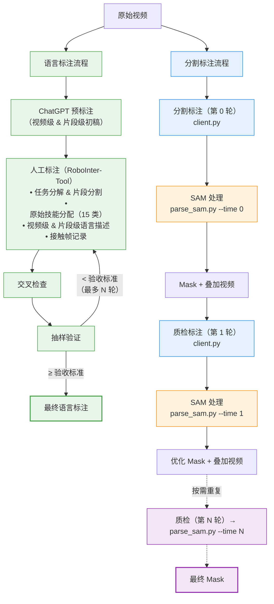
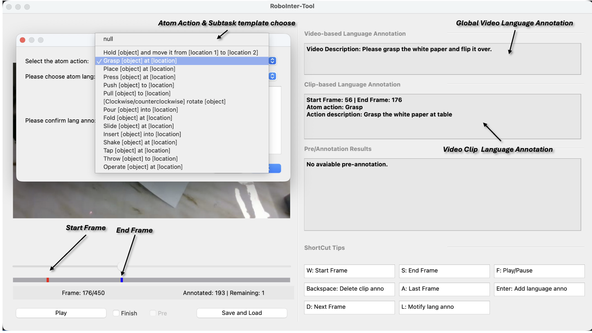
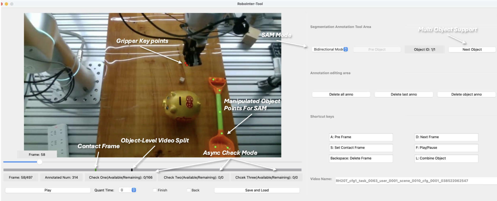

[English](README.md)

# RoboInter-Tools

本项目是 ICLR 2026 论文**RoboInter: A Holistic Intermediate Representation Suite Towards Robotic Manipulation**中的标注工具 **RoboInter-Tools** 的官方实现：

RoboInter-Tools 提供了基于 SAM2 (Segment Anything Model 2) 的视频分割与语言标注完整流程，包含多用户标注服务器、基于 Qt 的标注客户端，以及批量 SAM mask 生成管线。

分割整体工作流分为两个阶段：**标注** 和 **SAM mask 生成**。分割标注与 SAM 处理交替进行，形成多轮迭代质检流程，直到选择为困难样本或finish才会结束：



### 语言标注模式

<p align="center">
  
</p>

### 分割标注模式 (SAM)

<p align="center">
  
</p>

## 项目结构

```
tracker_tools_release/
├── client/
│   ├── client.py                  # Qt 标注客户端
│   └── utils.py                   # 服务器通信工具
├── server/
│   └── server.py                  # Flask 标注服务器
├── tools/
│   ├── parse_sam.py               # SAM 批处理脚本
│   ├── sam_tools.py               # SAM 核心函数
│   └── generate_annotation_pool.py
├── config/
│   └── config.yaml                # 配置文件
├── segment-anything-2/            # SAM2 模型
├── requirements.txt
└── README.md
```

## 安装

```bash
git clone <repository-url>
cd RoboInterTool
pip install -r requirements.txt
```

### 额外依赖

- Python 3.8+
- SAM2 模型权重和配置（参见 [SAM2](https://github.com/facebookresearch/sam2)）
```bash
git clone https://github.com/facebookresearch/sam2 segment-anything-2
cd segment-anything-2
pip install -e .
cd checkpoints
# 下载 SAM2.1 Hiera Large 权重
bash download_checkpoints.sh
```

## 配置

编辑 `config/config.yaml`：

```yaml
# SAM 模型配置
sam:
  sam_ckpt_path: "segment-anything-2/checkpoints/sam2.1_hiera_large.pt"
  model_config: "configs/sam2.1/sam2.1_hiera_l.yaml"
  threshold: 0.5
  device: "cuda:0"

# 标注服务器配置
server:
  root_dir: "/path/to/RoboInterTool"

  # 标注任务池 JSON 文件
  no_annotation_lang: "asserts/demo_data/no_annotation_lang.json"
  no_annotation_sam: "asserts/demo_data/no_annotation_sam.json"
  has_annotation_lang: "asserts/demo_data/has_annotation_lang.json"
  has_annotation_sam: "asserts/demo_data/has_annotation_sam.json"

  # 用户管理
  user_list_file: "asserts/demo_data/user_list.txt"
  user_history_dir: "user_config"

  # 标注保存路径模板（{video_name} 在运行时替换）
  save_path_lang_temp: "asserts/demo_data/human_anno_lang/{video_name}.npz"
  save_path_sam_temp: "asserts/demo_data/human_anno_sam/0/sam/{video_name}.npz"

  # SAM mask 生成输出路径（由 parse_sam.py 生成）
  sam_mask_save_path: "asserts/demo_data/human_anno_sam/0/sam_mask/{video_name}.npz"
  sam_video_save_path: "asserts/demo_data/human_anno_sam/0/sam_video/{video_name}.mp4"

  # 原始视频目录
  video_dir: "asserts/demo_data/video"

  # 错误日志
  error_log: "user_config/error_video.txt"
```

> **注意：** 路径中的 `/0/` 代表第 0 轮标注。`parse_sam.py` 会自动将 `/0/` 替换为 `/{time}/` 来生成其他轮次的路径。

---

## 第一部分：标注

标注分为两种类型：**语言标注** 和 **分割标注**。分割标注支持多轮标注用于质检。

### 1.1 准备数据

创建一个 JSON 文件，例如asserts/demo_data/video_2_lang_anno.json，映射视频路径到标注路径：

```json
{
  "asserts/demo_data/video_1.mp4": "asserts/demo_data/anno/video_1.npz",
  "asserts/demo_data/video_2.mp4": "asserts/demo_data/anno/video_2.npz"
}
```

如果没有已有标注文件，设置为空字符串：

```json
{
  "asserts/demo_data/video_1.mp4": "",
  "asserts/demo_data/video_2.mp4": ""
}
```

注：标注文件的样例如文件asserts/demo_data/lang_anno/RH20T_cfg2_task_0034_user_0003_scene_0007_cfg_0002.npz所示，构造类似文件即可正确载入与标注的语言文件，如果仅想进行分割标注，则直接设置为空字符串即可。

### 1.2 生成标注任务池

会按照提供的标注人员列表进行均匀分配。
```bash
python tools/generate_annotation_pool.py \
    --input asserts/demo_data/video_2_lang_anno.json \
    -o asserts/demo_data \
    --user-list users.txt
```

| 参数 | 必需 | 说明 |
|------|------|------|
| `--input, -i` | 是 | 输入 JSON 文件，映射视频路径到标注路径 |
| `--output, -o` | 是 | 生成 JSON 文件的输出目录 |
| `--user-list` | 否 | 用户名列表文件（每行一个用户名）。默认创建只含 `root` 的 `user_list.txt` |
| `--save-path-template` | 否 | 保存路径模板。默认：`asserts/demo_data/human_anno/0/{video_name}.npz` |

用户列表文件示例（`users.txt`）：

```
alice
bob
charlie
```

视频按轮询方式均匀分配给各用户。

### 1.3 启动服务器

```bash
# 单进程
python server/server.py --port 5000

# 多进程
python server/server.py --processes 4 --base-port 5000
```

### 1.4 启动标注客户端

```bash
cd client
python client.py
```

客户端连接服务器后提供两种标注模式：

- **语言标注：** 从预定义模板中选择原子动作，添加视频级和片段级语言描述。支持快捷键进行高效帧导航。
- **分割标注 (SAM)：** 在视频帧上点击正/负样本点进行 SAM 物体分割。功能包括：
  - 多物体支持，可切换物体 ID
  - 双向跟踪模式
  - 接触帧标记
  - 多轮标注用于质检（初始界面选择）：
    - **第 0 轮（`--time 0`）：** 在原始视频上进行初始标注
    - **第 1 轮+（`--time 1, 2, ...`）：** 在上一轮 SAM 生成结果上进行质检，标注员查看 mask 叠加视频并修正标注

---

## 第二部分：SAM Mask 生成

每一轮分割标注完成后，都可以运行 `parse_sam.py` 从标注配置生成 SAM mask 和叠加视频。

### 2.1 运行 SAM 处理

```bash
python tools/parse_sam.py --username {name} --time {time}
```

| 参数 | 必需 | 默认值 | 说明 |
|------|------|--------|------|
| `--username` | 否 | `root` | 标注员用户名（对应用户历史文件） |
| `--time` | 否 | `0` | 标注轮次（0 = 初始标注，1+ = 质检轮次） |
| `--low` | 否 | - | 使用低分辨率 SAM 配置（`sam2.1_hiera_l_lowres.yaml`），防止现存爆炸 |
| `--config` | 否 | `./config/config.yaml` | 配置文件路径 |

**示例：**

```bash
# 处理用户 alice 的第 0 轮初始标注
python tools/parse_sam.py --username alice --time 0

# 处理用户 bob 的第 1 轮质检
python tools/parse_sam.py --username bob --time 1

# 使用低分辨率模型加速处理
python tools/parse_sam.py --username alice --time 0 --low
```

### 2.2 `parse_sam.py` 处理流程

对于用户标注列表中的每个视频：

1. **跳过检查：** 如果下一轮标注配置已存在，则跳过（已被质检过）
2. **缓存检查：** 如果 mask 和视频输出都已存在，跳过处理（加入更新列表）
3. **加载标注配置**：从 `human_anno_sam/{time}/sam/{video_name}.npz` 读取
4. **过滤：** 跳过已完成/困难样本/问题样本（time >= 1 时记录到对应列表）
5. **运行 SAM2 推理**：通过 `predict_sam_video_multiframe`
6. **保存 mask**：到 `human_anno_sam/{time}/sam_mask/{video_name}.npz`
7. **生成叠加视频**：到 `human_anno_sam/{time}/sam_video/{video_name}.mp4`
8. **更新标注任务池 JSON：**
   - 将已处理视频添加到 `no_annotation_sam.json`（排入下一轮队列）
   - 从 `has_annotation_sam.json` 移除已处理视频
   - 清理旧轮次条目和特殊样本

### 2.3 各轮次目录结构

```
human_anno_sam/
├── 0/                          # 第 0 轮
│   ├── sam/                    # 标注配置（来自客户端）
│   │   └── {video_name}.npz
│   ├── sam_mask/               # 生成的 mask（由 parse_sam.py 生成）
│   │   └── {video_name}.npz
│   └── sam_video/              # 生成的叠加视频（由 parse_sam.py 生成）
│       └── {video_name}.mp4
├── 1/                          # 第 1 轮（质检）
│   ├── sam/
│   ├── sam_mask/
│   └── sam_video/
└── ...
```

---

## 服务器 API

| 接口 | 方法 | 说明 |
|------|------|------|
| `/health` | GET | 健康检查 |
| `/is_available_user` | POST | 验证用户 |
| `/get_video` | POST | 获取下一个待标注视频 |
| `/save_anno` | POST | 保存标注结果 |
| `/drawback` | POST | 退回视频到未标注池 |
| `/stats` | GET | 获取标注统计信息（含各用户明细） |

## 数据格式

### 标注配置（`.npz`）

```python
{
    "video_path": str,           # 视频路径
    "is_video": bool,            # True 为视频，False 为单帧
    "select_frame": int,         # 起始帧索引
    "select_frames": list,       # 多关键帧（多帧模式）
    "direction": str,            # "forward"、"backward" 或 "bidirection"
    "positive_points": dict,     # {帧索引: {物体ID: [[x, y], ...]}}
    "negative_points": dict,     # {帧索引: {物体ID: [[x, y], ...]}}
    "labels": dict,              # {帧索引: {物体ID: [1, 1, 0, ...]}}
    "is_finished": bool,         # 是否标记为完成
    "is_hard_sample": bool,      # 是否为特殊样本
    "hard_sample_type": str      # "困难样本" 或 "问题样本"
}
```

### Mask 输出（`.npz`）

```python
{
    "masks": np.ndarray  # 形状: (物体数, 帧数, 1, 高, 宽), dtype=bool
}
```

## 引用

```bibtex
@inproceedings{
}
```

## License

和主仓库一致
